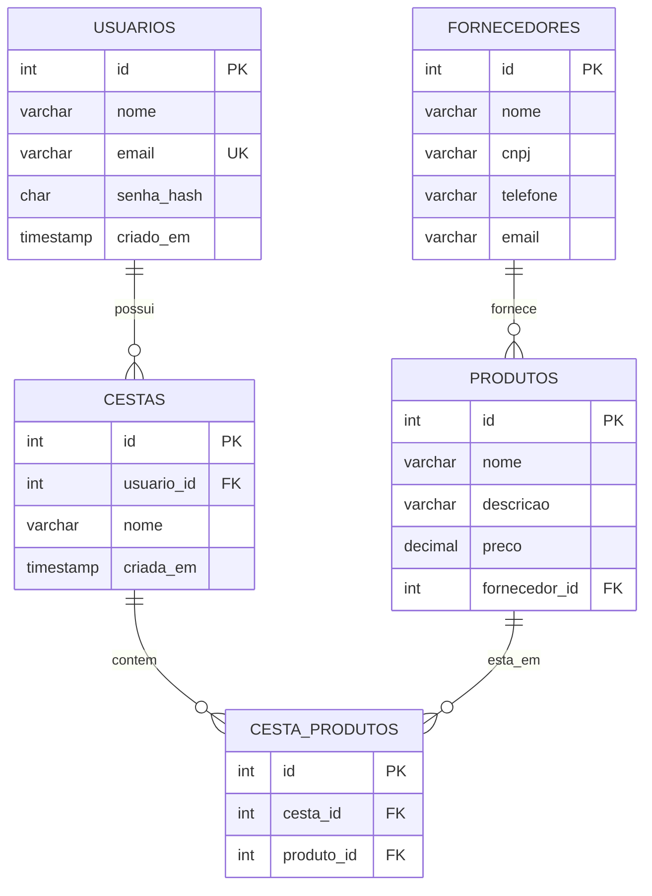

# Mini Sistema de Gestão de Produtos

Trabalho da disciplina de Programação Web — Análise e Desenvolvimento de Sistemas.

Sistema web para cadastrar **fornecedores**, **produtos** e **cestas**, escolher produtos numa lista e montar uma cesta de compras com resumo de quantidade e valor total. Cada produto conta como **1 unidade** (não existe campo de quantidade).

## Integrantes

| Nome | RA |
|------|----|
| Lucas Ksiozek Pereira | 60006032 |


## Funcionalidades

- Cadastro e login de usuários (senha salva com hash **SHA-256**)
- Cadastro de fornecedores, produtos e cestas (banco de dados MySQL)
- Área **Gerenciar** com **AJAX**: editar e excluir os 3 elementos sem recarregar a página
- Área **Produtos**: lista com checkbox e validação (mínimo de 2 produtos marcados) para adicionar na cesta
- Área **Minha Cesta**: produtos escolhidos, quantidade total e valor total
- Menu de navegação em todas as telas
- Banco de dados e tabelas criados automaticamente na primeira execução

## Tecnologias

- PHP 8 (orientação a objetos + PDO)
- MySQL / MariaDB
- HTML, CSS e JavaScript (fetch/AJAX)
- Bootstrap 5

## Como executar

1. Instale o [XAMPP](https://www.apachefriends.org/) (ou outro ambiente com PHP 8 + MySQL).
2. Copie a pasta do projeto para `C:\xampp\htdocs\gestao-produtos` (Windows) ou `/opt/lampp/htdocs/`.
3. Abra o painel do XAMPP e inicie **Apache** e **MySQL**.
4. Se o seu MySQL tiver senha, ajuste `config/Conexao.php` (usuário padrão: `root`, sem senha).
5. Acesse `http://localhost/gestao-produtos/`.
6. Clique em **Criar conta**, faça login e comece pelos **Cadastros** (primeiro um fornecedor, depois produtos).

O banco `gestao_produtos` e as tabelas são criados sozinhos no primeiro acesso.

> Alternativa sem XAMPP: dentro da pasta do projeto, rode `php -S localhost:8000` (precisa do MySQL ligado e da extensão `pdo_mysql`).

## Estrutura de pastas

```
gestao-produtos/
├── config/Conexao.php      # conexão PDO + criação automática do banco/tabelas
├── classes/                # Usuario, Fornecedor, Produto, Cesta
├── inc/                    # sessão, funções, topo (menu) e rodapé
├── assets/css, assets/js   # estilos e scripts (gerenciar.js = AJAX, loja.js = validação)
├── api.php                 # respostas JSON usadas pelo AJAX
├── login.php, registrar.php, logout.php
├── cadastros.php           # cadastro dos 3 elementos
├── gerenciar.php           # edição via AJAX
├── loja.php                # lista de produtos com checkbox
└── cesta.php               # cesta com resumo
```

## Modelagem (DER)

> Inserir aqui a imagem exportada do MySQL Workbench:
>
> ``

Versão em texto do relacionamento:



## Protótipos das telas (Figma)

> Inserir aqui as imagens exportadas do Figma e o link do projeto.

| Tela | Imagem |
|------|--------|
| Login / Criar conta | `docs/figma-login.png` |
| Cadastros | `docs/figma-cadastros.png` |
| Gerenciar (AJAX) | `docs/figma-gerenciar.png` |
| Produtos | `docs/figma-produtos.png` |
| Minha Cesta | `docs/figma-cesta.png` |

## Segurança

- Senhas salvas com SHA-256 (`hash('sha256', ...)`), conforme pedido no enunciado. Em um sistema real o ideal seria `password_hash()` (bcrypt/argon2), que usa salt automático.
- Consultas com **PDO e prepared statements** (protege contra SQL Injection).
- Saída escapada com `htmlspecialchars` (protege contra XSS).
- Validação no navegador **e** no servidor.
- Cada usuário só acessa as próprias cestas.

## Padrão de commits

Mensagens curtas no imperativo, seguindo a ideia do [Keep a Changelog](https://keepachangelog.com/pt-BR/1.0.0/): `Adiciona ...`, `Corrige ...`, `Altera ...`, `Remove ...`.
